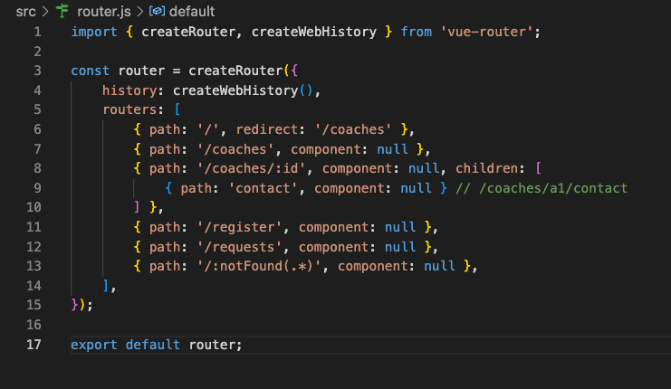

# Find a Coach 

## Getting Started

``npm install``

``npm run serve``

## Additional packages used

``npm install --save vue-router``

``npm install --save vuex ``

## Steps

1. Add a router.js file next to main.js and initialise

## Resources

Tutorial project is from Udemy Vue.js by Maximilian Schwarzmüller

