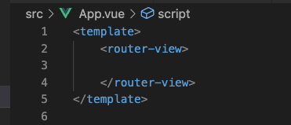

# Find a Coach 

## Getting Started

``npm install``

``npm run serve``

## Additional packages used

``npm install --save vue-router``

``npm install --save vuex ``

## Steps

1. Add a router.js file next to main.js and initialise

2. Add a pages folder (set the pages apart from the components)
3. Add sub folders for the different features (coaches and requests)
4. Set up App.vue file with ``<router-view>``

5. Configure main.js file with App.vue (this is the main file)

6. Test that everything works: see styling, headings, routes
7. Add a store folder with a index.js file (this is for vuex to manage data)

8. Add a modules folder (keep all the features as seperate files in one folder)
9. Seperate into Coaches/ Requests folder 
10. Inside Coaches folder, seperate the logic into:

* actions.js
* getters.js
* mutations.js
* index.js

11. Set up the Coaches / Index.js file to export default 

12. Return state in coaches/ index.js file 

! add ``export default {};`` to every empty file so that this works. 

13. Add getters to Coaches / getters.js file

Learn more about getters: <https://vuex.vuejs.org/guide/getters.html>

Remember to import the main index.js file, store folder to main.js file

14. 

## Images 

Progress shot 1: 

* Added routes/ pages 
* Added Header and navigation

Progress shot 2:

* Added Coach Items and "fake" data

## Resources

Tutorial project is from Udemy Vue.js by Maximilian Schwarzmüller

